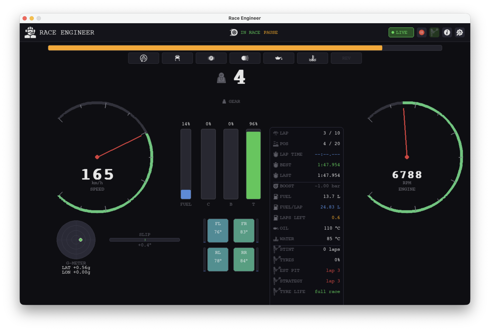
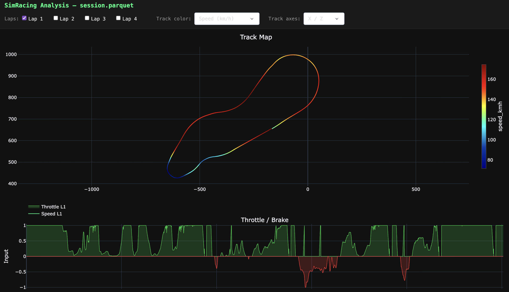
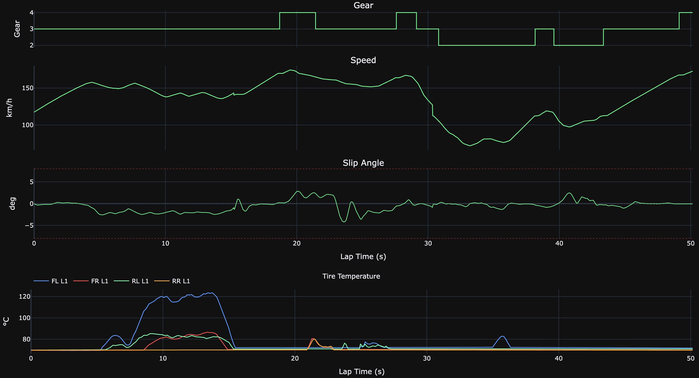

# Sim Race Engineer

**Sim Race Engineer** is a real-time telemetry dashboard for sim racing.
It connects to Gran Turismo 7 (for now) via UDP and displays live driving data on a second screen or overlay,
giving the driver the kind of feedback and voice communication a real motorsport engineer would provide from the pit wall.

**Dashboard**

The dashboard is designed to help drivers improve lap times by making tyre state, weight transfer,
G-forces, fuel consumption, and electronic interventions immediately visible — information that is
buried inside the game's menus or simply not shown at all.



**Voice Communication**

Spoken alerts to replicate a real pit-wall engineer calling out fuel status,
tyre health, engine thermals, lap pace, and pit-stop timing — in English or Portuguese.
The strategy engine automatically computes when to pit based on fuel and tyre life,
and can follow a pre-configured stop plan with approach warnings and reschedule notifications.


**Session Record Analysis**

After each session, an interactive web viewer lets you analyse every recorded lap side by side.
Lap times, fuel consumption, tyre temperatures, G-forces, and pedal traces are plotted with Plotly Dash,
making it easy to compare stints, spot consistency issues, and identify where time is gained or lost.





---

## Features

### Dashboard

| Widget | Data |
|--------|------|
| Speed & RPM gauges | Current speed (km/h) and engine revs with colour-coded zones |
| RPM bar | Full-width strip for at-a-glance shift timing |
| Gear display | Current gear, neutral, reverse, and game-suggested gear |
| Pedal bars | Clutch · Brake · Throttle input (0–100%) |
| Fuel bar | Tank fill percentage |
| G-meter | Lateral and longitudinal G-force as a circular trace |
| Slip angle | Horizontal bar showing yaw between heading and velocity (oversteer) |
| Tyre tiles | Per-corner surface temperature with colour zones (cold / optimal / hot) |
| Wheel slip | Orange border = wheelspin · Red border = lockup |
| Suspension bars | Per-corner travel bar showing load distribution in real time |
| Status strip | TCS · ASM · REV limiter · Handbrake · Lights · OIL! · H₂O! chips |
| Info panel | Lap times · Race position · Fuel/lap · Laps remaining · Water/oil · Boost |
| Race status | IN RACE · PIT / MENU · FINISHED · FREE SESSION badges in the header |
| Rev flash | Optional full-screen red flash at rev limiter |

### Voice Communication — Pit Wall Engineer

Spoken alerts via offline Piper TTS. Available in **English** and **Portuguese**.
Each alert has an independent cooldown to avoid repetition.

| Alert | Trigger | Cooldown |
|-------|---------|----------|
| Lap completed | Lap counter changes, no new best lap | — |
| Best lap | New personal best set | — |
| Final lap | Entering the last lap of a race | — |
| Lap delta | Lap time > 3 s off best (fires once, after halfway point) | once/lap |
| Fuel low | Fuel < 20% · includes estimated laps remaining | once/lap |
| Fuel critical | Fuel < 10% | once/lap |
| Fuel < 1 lap | Less than 1 lap of fuel · highest priority fuel alert | once/lap |
| Pit window | 2–4 laps of fuel remaining in a race ("Box box box") | once/lap |
| Water temp | Coolant > 105 °C | 20 s |
| Oil temp | Oil > 130 °C | 20 s |
| Tyre temp | Any surface > 100 °C · names the hot corners | 30 s |
| Tyre wear | Any inner zone > 110 °C (proxy for wear) · names corners | 30 s |
| Tyre wear % | Stint avg wear hits each 10% block above threshold | once/bucket |
| Pressure low | Any tyre < 160 kPa | once/lap |
| Pressure high | Any tyre > 250 kPa | once/lap |
| Strategy: pit window | Auto strategy: in pit window, can't finish · reason named | once/lap |
| Strategy: tyres | Tyres degrading · 2–5 laps to projected mandatory pit | once/lap |
| Planned: approaching | 2 laps before planned stop · "Pit in N lap(s)" | once |
| Planned: box now | On the planned stop lap · "Box this lap. On strategy." | once |
| Planned: tyre warning | Tyres won't last to planned stop lap | once |
| Planned: missed | Missed stop window · reschedules if fuel allows | once |

All thresholds are configurable in `~/simracing/simracing.conf`.
Each alert can be individually enabled or disabled in the in-app Settings panel.

### Lap Recording

Sessions and laps are saved automatically as **Apache Parquet** (Snappy) at ~60 Hz.
No manual action required — recording starts with the session and stops at race end.

| What | Detail |
|------|--------|
| Location | `~/simracing_laps/<YYYY-MM-DDTHHMMSS>/lap_NN.parquet` |
| Per-frame | Speed · RPM · gear · throttle · brake · clutch · handbrake |
| Per-frame | Position (XYZ) · velocity · G-forces · slip angle |
| Per-frame | Tyre temps (surface + inner/mid/outer) · tyre pressure · suspension |
| Per-frame | Water temp · oil temp · fuel level · turbo boost |
| Per-lap | Lap time · fuel used · fuel avg · pedal counters |

Recording can be toggled mid-session via the **REC** button in the header.

### Lap Analysis — Post-Session Viewer

After a session, run the web viewer to explore recorded laps interactively in the browser.

| Chart | Data |
|-------|------|
| Track map | Racing line plotted from XYZ position data, coloured by speed or TCS/ASM intervention |
| Tyre temperatures | Surface temp per corner across the lap, overlaid for all selected laps |
| Timeseries | Throttle · Brake · Gear · Speed · Slip angle — shared time axis across laps |

```bash
sim-analysis ~/simracing_laps/<session-folder>
```

---

## In-App Help

Press **?** (info button in the header) to open the UI Guide — a 3-tab reference panel:

| Tab | Content |
|-----|---------|
| DASHBOARD | Every widget, indicator, and colour code explained |
| APP GUIDE | Lap recording format, settings, and header controls |
| VOICE ALERTS | Each voice event, its trigger condition, and how to interpret it |

---

## Setup

```bash
uv venv && source .venv/bin/activate

# Dashboard only
uv pip install -e ".[dev]"

# With voice alerts (requires Piper TTS models in ~/simracing/piper/)
uv pip install -e ".[dev,voice]"
```

### Piper TTS models

Download models into `~/simracing/piper/`:

```bash
# English (default)
# en_US-lessac-medium.onnx + .json

# Portuguese
# pt_BR-faber-medium.onnx + .json
```

Models are available at [rhasspy/piper](https://github.com/rhasspy/piper/blob/master/VOICES.md).

---

## Running

```bash
sh run.sh
```

On first launch, the Settings panel opens automatically. Enter the device IP address and save.
The IP is persisted to `~/simracing/simracing.conf` and reused on subsequent launches.

```bash
# Or pass the IP directly
sim-dashboard --device-ip 192.168.1.100

# Or via environment variable
SIMRACING_DEVICE_IP=192.168.1.100 sim-dashboard
```

The PS5 must be on the same network. Enable telemetry output in GT7:
**Options → Machine Settings → Send Vehicle Data → On**

---

## Roadmap

[Roadmap for this project](docs/roadmap.md)
