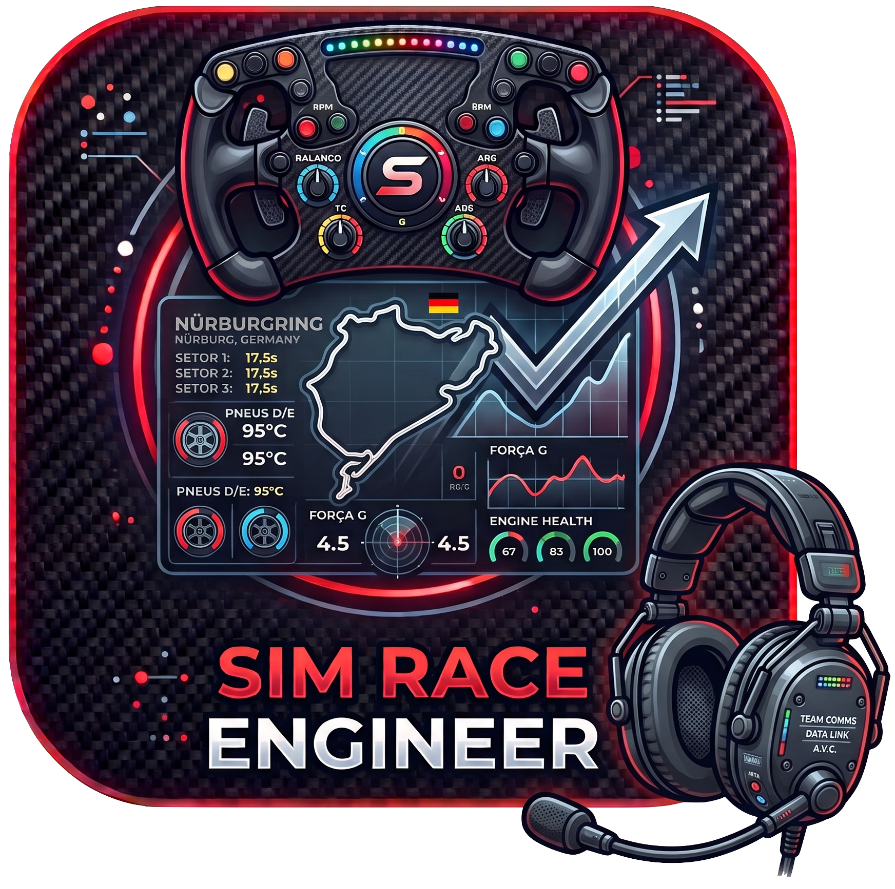
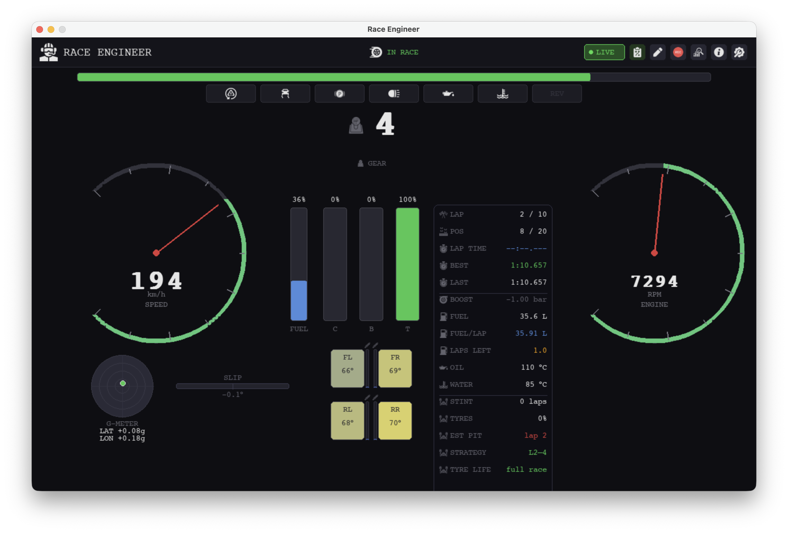
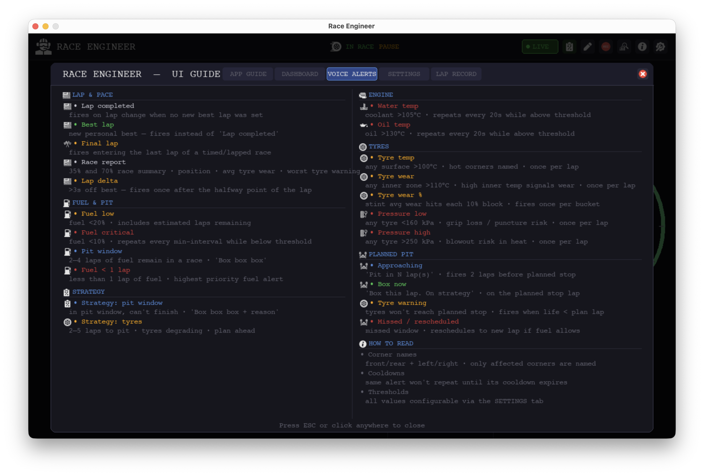
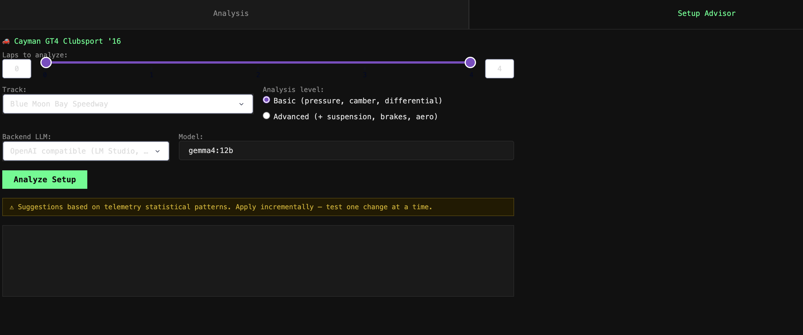

# Sim Race Engineer



**Sim Race Engineer** is a real-time telemetry dashboard for sim racing.
It connects to Gran Turismo 7 (for now) via UDP and displays live driving data on a second screen or overlay,
giving the driver the kind of feedback and voice communication a real motorsport engineer would provide from the pit wall.

**Dashboard**

The dashboard is designed to help drivers improve lap times by making tyre state, weight transfer,
G-forces, fuel consumption, and electronic interventions immediately visible — information that is
buried inside the game's menus or simply not shown at all.



**Voice Communication**

Spoken alerts to replicate a real pit-wall engineer calling out fuel status,
tyre health, engine thermals, lap pace, and pit-stop timing — in English or Portuguese.
The strategy engine automatically computes when to pit based on fuel and tyre life,
and can follow a pre-configured stop plan with approach warnings and reschedule notifications.



**Session Record Analysis**

After each session, an interactive web viewer lets you analyse every recorded lap side by side.
Lap times, fuel consumption, tyre temperatures, G-forces, and pedal traces are plotted with Plotly Dash,
making it easy to compare stints, spot consistency issues, and identify where time is gained or lost.


### AI Setup Advisor

The Lap Analysis viewer includes a **Setup Advisor** tab powered by an LLM.
It reads telemetry from the selected laps and produces concrete car setup recommendations in the format used by the GT7 setup menu.



---

## Features

### Dashboard

| Widget | Data |
|--------|------|
| Speed & RPM gauges | Current speed (km/h) and engine revs with colour-coded zones |
| RPM bar | Full-width strip for at-a-glance shift timing |
| Gear display | Current gear, neutral, reverse, and game-suggested gear |
| Pedal bars | Clutch · Brake · Throttle input (0–100%) |
| Fuel bar | Tank fill percentage |
| G-meter | Lateral and longitudinal G-force as a circular trace |
| Slip angle | Horizontal bar showing yaw between heading and velocity (oversteer) |
| Tyre tiles | Per-corner surface temperature with colour zones (cold / optimal / hot) |
| Wheel slip | Orange border = wheelspin · Red border = lockup |
| Suspension bars | Per-corner travel bar showing load distribution in real time |
| Status strip | TCS · ASM · REV limiter · Handbrake · Lights · OIL! · H₂O! chips |
| Info panel | Lap times · Race position · Fuel/lap · Laps remaining · Water/oil · Boost |
| Race status | IN RACE · PIT / MENU · FINISHED · FREE SESSION badges in the header |
| Rev flash | Optional full-screen red flash at rev limiter |

### Voice Communication — Pit Wall Engineer

Spoken alerts via offline Piper TTS. Available in **English** and **Portuguese**.
Each alert has an independent cooldown to avoid repetition.

| Alert | Trigger | Cooldown |
|-------|---------|----------|
| Lap completed | Lap counter changes, no new best lap | — |
| Best lap | New personal best set | — |
| Final lap | Entering the last lap of a race | — |
| Lap delta | Lap time > 3 s off best (fires once, after halfway point) | once/lap |
| Fuel low | Fuel < 20% · includes estimated laps remaining | once/lap |
| Fuel critical | Fuel < 10% | once/lap |
| Fuel < 1 lap | Less than 1 lap of fuel · highest priority fuel alert | once/lap |
| Pit window | 2–4 laps of fuel remaining in a race ("Box box box") | once/lap |
| Water temp | Coolant > 105 °C | 20 s |
| Oil temp | Oil > 130 °C | 20 s |
| Tyre temp | Any surface > 100 °C · names the hot corners | 30 s |
| Tyre wear | Any inner zone > 110 °C (proxy for wear) · names corners | 30 s |
| Tyre wear % | Stint avg wear hits each 10% block above threshold | once/bucket |
| Pressure low | Any tyre < 160 kPa | once/lap |
| Pressure high | Any tyre > 250 kPa | once/lap |
| Race report | At 35% and 70% of the race: position + laps remaining + avg tyre wear; follow-up if one corner leads in wear | once/checkpoint |
| Strategy: pit window | Auto strategy: in pit window, can't finish · reason named | once/lap |
| Strategy: tyres | Tyres degrading · 2–5 laps to projected mandatory pit | once/lap |
| Planned: approaching | 2 laps before planned stop · "Pit in N lap(s)" | once |
| Planned: box now | On the planned stop lap · "Box this lap. On strategy." | once |
| Planned: tyre warning | Tyres won't last to planned stop lap | once |
| Planned: missed | Missed stop window · reschedules if fuel allows | once |
| Laps to go | Countdown at 5, 4, 3, 2, 1 laps remaining (races ≥ 10 laps) | — |
| Fuel save | Fuel margin < 1.5 laps to finish — recommends lift and coast | once/lap |
| Strategy check-in | Proactive fuel + box lap briefing — at 33%/66% (≥ 10 laps) or every 3 laps | once/lap |
| Strategy revised | Pit lap shifted > 2 laps from ideal — prompts driver to adapt | 60 s |
| Fuel save+ | Fuel delta 0–2 L — lift and coast to extend range | once/lap |
| Advisor pit window | Approaching alert 1–2 laps before advisor window opens; entry alert when window is active | once/window |
| Overtake | Position gained → encouragement; position lost → support | 15 s |

All thresholds are configurable in `~/sim-race-engineer/sim-race.conf`.
Each alert can be individually enabled or disabled in the in-app Settings panel.

### Race Strategy

Real-time strategy engine that computes pit stop recommendations from live fuel consumption and tyre wear data.

**Auto Strategy** — recalculated every lap:

| Field | Description |
|-------|-------------|
| Laps to fuel out | Fuel remaining ÷ average fuel per lap |
| Laps to tyre limit | Laps until wear reaches the configured threshold (default 80%) |
| Recommended pit lap | Earliest safe stop lap, accounting for pit buffer (default 1 lap) |
| Pit reason | `FUEL` · `TYRES` · `FUEL+TYRES` (when both converge within 2 laps) |
| Can finish direct | Whether fuel and tyres last to the end without stopping |

**Planned Strategy** — up to 3 user-defined pit stops, configured via the Strategy panel (**S** key):

| Alert | Trigger |
|-------|---------|
| Approaching | 2 laps before the planned stop lap |
| Box now | On the planned stop lap |
| Tyre warning | Tyres projected to degrade before reaching the planned stop |
| Missed | Stop lap passed without pitting — auto-reschedules to earliest safe lap if fuel allows |

Pit entry is detected automatically and marks the corresponding stop as done.
Tyre wear limit and pit buffer are configurable in the Strategy panel and `~/sim-race-engineer/sim-race.conf`.

**Strategy Advisor** — proactive race engineer logic, computed every lap:

| Output | Description |
|--------|-------------|
| Fuel to finish | Total litres needed from current lap to chequered flag |
| Fuel delta | Surplus (positive) or shortfall (negative) vs current tank |
| Laps to fuel out | `fuel_level ÷ avg_rate` and `fuel_level ÷ last_lap_rate` |
| Fuel save laps | Extra laps achievable with 10% lift-and-coast saving |
| Recommended stops | 0–3 stops derived from fuel shortfall |
| Stop windows | Evenly distributed optimal pit laps (open–close) |
| Strategy health | `ON_PLAN` · `REVISE` · `CRITICAL` shown in the Strategy panel |
| Avg lap time | Rolling average of last 3 completed laps (ms) |

The advisor fires three voice alerts:
- **Check-in** (33%/66% of race, or every 3 laps for short races): fuel laps + recommended box lap.
- **Revised**: when health flips to `REVISE` and the optimal pit lap moves > 2 laps.
- **Fuel save+**: when fuel delta is between 0 and `fuel_save_delta_l` (default 2 L).

Advisor config keys in `~/sim-race-engineer/sim-race.conf` under `[strategy]`:

| Key | Default | Effect |
|-----|---------|--------|
| `pit_loss_time_s` | `25.0` | Estimated time lost per pit stop (reserved for future time-loss model) |
| `strategy_check_in_interval_laps` | `3` | Check-in interval for races < 10 laps |
| `fuel_save_delta_l` | `2.0` | Fuel delta threshold (L) that triggers the fuel-save+ alert |
| `lap_time_buffer` | `3` | Number of recent laps used for avg lap time calculation |

### Lap Recording

Sessions and laps are saved automatically as **Apache Parquet** (Snappy) at ~60 Hz.
No manual action required — recording starts with the session and stops at race end.

| What | Detail |
|------|--------|
| Location | `~/sim-race-engineer/laps/<YYYY-MM-DDTHHMMSS>/lap_NN.parquet` |
| Per-frame | Speed · RPM · gear · throttle · brake · clutch · handbrake |
| Per-frame | Position (XYZ) · velocity · G-forces · slip angle |
| Per-frame | Tyre temps (surface + inner/mid/outer) · tyre pressure · suspension |
| Per-frame | Water temp · oil temp · fuel level · turbo boost |
| Per-lap | Lap time · fuel used · fuel avg · pedal counters |

Recording can be toggled mid-session via the **REC** button in the header.

### Lap Analysis — Post-Session Viewer

After a session, explore recorded laps interactively in the browser.

| Chart | Data |
|-------|------|
| Track map | Racing line plotted from XYZ position data, coloured by speed or TCS/ASM intervention |
| Tyre temperatures | Surface temp per corner across the lap, overlaid for all selected laps |
| Timeseries | Throttle · Brake · Gear · Speed · Slip angle — shared time axis across laps |

**From the dashboard** — click the graph icon in the header. A file picker opens pointing to
`~/sim-race-engineer/laps/`; select any session folder or individual `lap_NN.parquet` file.
The viewer launches at `http://127.0.0.1:8050` and the icon turns green while it is running.
Clicking again while it is active reopens the browser tab.

**From the command line** (running from source):

```bash
# Via Makefile
make analysis ~/sim-race-engineer/laps/<session-folder>
make analysis ~/sim-race-engineer/laps/<session-folder>/lap_03.parquet

# Or with the venv activated
source .venv/bin/activate
sim-race-analyze ~/sim-race-engineer/laps/<session-folder>
sim-race-analyze <path> --port 8080      # custom port
sim-race-analyze <path> --no-browser     # skip auto-opening the browser
```

### Setup Advisor — AI Car Setup Suggestions

The Lap Analysis viewer includes a **Setup Advisor** tab powered by an LLM.
It reads telemetry from the selected laps and produces concrete car setup recommendations in the format used by the GT7 setup menu.

| Input | Detail |
|-------|--------|
| Tyre temperatures | Surface + inner/mid/outer per corner — diagnoses camber, pressure, and load imbalance |
| G-forces | Lateral load distribution — hints at aero, suspension balance |
| Slip angle | Oversteer/understeer tendency |
| Electronics | TCS and ASM intervention rate — suggests differential and traction tuning |
| Pedal trace | Full-throttle, full-brake, coasting, and overlap ticks |

Two analysis levels are available in the UI:
- **Basic** — tyre pressure, camber (inner/outer temp imbalance), differential, TCS
- **Advanced** — adds suspension (ride height, spring stiffness), brake balance, aerodynamics

**LLM backends** — configure in `~/sim-race-engineer/sim-race.conf` under `[llm]`:

| Key | Default | Options |
|-----|---------|---------|
| `backend` | `openai` | `ollama` · `anthropic` · `openai` |
| `model` | `gemma4:12b` | Any model name supported by the backend |
| `api_key` | _(empty)_ | Required for Anthropic; use any string for local servers |
| `base_url` | `http://localhost:1234/v1` | Ollama: `http://localhost:11434` · LM Studio: `http://localhost:1234/v1` |

`openai` backend is compatible with any OpenAI-format server: LM Studio, LocalAI, vLLM, etc.

---

## In-App Help

Press **?** (info button in the header) to open the UI Guide — a 3-tab reference panel:

| Tab | Content |
|-----|---------|
| DASHBOARD | Every widget, indicator, and colour code explained |
| APP GUIDE | Lap recording format, settings, and header controls |
| VOICE ALERTS | Each voice event, its trigger condition, and how to interpret it |

---

## Setup

```bash
make install
```

Installs the core dashboard and all optional extras (voice, analysis, advisor).

To install only specific extras:

```bash
uv pip install -e '.'                  # core dashboard only
uv pip install -e '.[voice]'           # + Piper TTS voice alerts
uv pip install -e '.[analysis]'        # + post-session lap analysis viewer
uv pip install -e '.[advisor]'         # + AI setup advisor (Ollama / Anthropic / OpenAI)
uv pip install -e '.[voice,analysis,advisor]'  # everything
```

### Piper TTS models

Downloaded automatically from HuggingFace on first launch (~200 MB per voice) into `~/sim-race-engineer/piper/`.
No manual step required.

---

## Running

```bash
sh run.sh
```

On first launch, the Settings panel opens automatically. Enter the device IP address and save.
The IP is persisted to `~/sim-race-engineer/sim-race.conf` and reused on subsequent launches.

```bash
# Or pass the IP directly
sim-race-engineer --device-ip 192.168.1.100

# Or via environment variable
SIMRACING_DEVICE_IP=192.168.1.100 sim-race-engineer
```

The PS5 must be on the same network. Enable telemetry output in GT7:
**Options → Machine Settings → Send Vehicle Data → On**

---

## Roadmap

[Roadmap for this project](docs/roadmap.md)


---

## Resources

- [gt7-udp — GT7 UDP protocol reverse-engineering reference](https://github.com/MacManley/gt7-udp)
- [GTPlanet forum — GT7 UDP packet structure community research](https://www.gtplanet.net/forum/threads/gt7-is-compatible-with-motion-rig.410728/page-4)
- [GT7Proxy — GT7 packet field definitions (vthinsel)](https://github.com/vthinsel/GT7Proxy/blob/main/gt_packet_definition.py)

