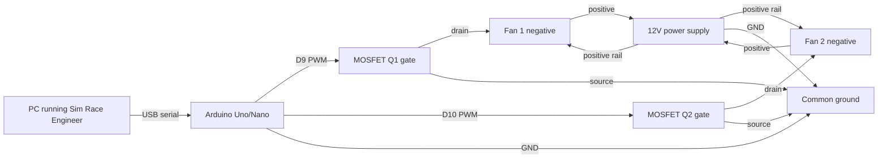

# Microcontroller — Hardware Guide

## Overview

The Airflow Simulation feature drives two 12V frontal fans whose speed follows the car's speed in-game, giving physical wind feedback while driving. The dashboard talks to a microcontroller (Arduino Uno/Nano-class board) over USB serial using a simple ASCII line protocol; the microcontroller drives the fans via PWM through a MOSFET switching stage (fans draw far more current than a microcontroller pin can supply).

Reference firmware: [`firmware/microcontroller/fan_airflow.ino`](../../firmware/microcontroller/fan_airflow.ino)

---

## Wire Protocol

| Parameter | Value |
|---|---|
| Transport | USB serial (CDC) |
| Baud rate | `9600` |
| Line format | ASCII, `\n`-terminated |

| Direction | Message | Meaning |
|---|---|---|
| App → device | `FAN:<0-255>\n` | Set PWM duty cycle for both frontal fans (same value) |
| App → device | `PING\n` | Connection test |
| Device → app | `PONG\n` | Reply to `PING` |

**Failsafe:** the firmware turns both fans off if no `FAN:` command is received within **1000 ms**. This timer is *not* reset by `PING`/`PONG` traffic — only a genuine `FAN:` command counts, so a connection-test loop can never keep the fans spinning without real speed data. The firmware also boots with duty `0` and stays off until the first valid `FAN:` command arrives.

---

## Wiring

Each fan channel is switched on the negative (low) side by an N-channel MOSFET, driven by a PWM-capable digital pin on the Arduino. Both fans are powered from a separate 12V supply that shares a common ground with the Arduino — the Arduino itself never carries fan current.

### Connection table (per fan channel)

| From | To |
|---|---|
| Arduino PWM pin (e.g. D9 for fan 1, D10 for fan 2) | MOSFET gate, through a 220Ω resistor |
| MOSFET gate | 10kΩ resistor to ground (pull-down, prevents floating gate at boot) |
| MOSFET source | Common ground (Arduino GND + 12V supply GND, tied together) |
| MOSFET drain | Fan's negative (–) wire |
| Fan's positive (+) wire | 12V supply positive rail |
| Flyback diode (1N4001) | Cathode to 12V positive rail, anode to MOSFET drain (i.e. in parallel with the fan, reverse-biased) — absorbs the inductive voltage spike when the fan switches off |

### Text/ASCII wiring diagram

```
                    +12V supply rail
                         |
                         +-------------------+
                         |                   |
                       Fan 1 (+)          Fan 2 (+)
                         |                   |
                       Fan 1 (-)          Fan 2 (-)
                         |                   |
                    [1N4001]            [1N4001]   (cathode to +12V, parallel with fan)
                         |                   |
                    MOSFET Q1 Drain     MOSFET Q2 Drain
                         |                   |
                    MOSFET Q1 Source    MOSFET Q2 Source
                         |                   |
                         +--------+----------+---- Common GND (Arduino GND + 12V supply GND)
                                  |
Arduino D9  --[220R]-- Q1 Gate    |
Arduino D10 --[220R]-- Q2 Gate    |
Q1 Gate --[10k pulldown]-- GND    |
Q2 Gate --[10k pulldown]-- GND ---+

Arduino <--USB--> PC (Sim Race Engineer app)
```

### Mermaid version



---

## Bill of Materials (BOM)

| Qty | Component | Approximate spec |
|---|---|---|
| 1 | Microcontroller board | Arduino Uno or Arduino Nano (5V logic, at least 2 PWM-capable digital pins) |
| 2 | DC fan | 12V DC fan, 120mm, 2- or 3-wire (see [Fan Recommendations](#fan-recommendations)) |
| 2 | N-channel MOSFET, logic-level | e.g. IRLZ44N (gate fully turns on from a 5V microcontroller pin) |
| 2 | Flyback diode | 1N4001 (or similar 1N400x rectifier diode), one per fan, to absorb inductive switch-off spikes |
| 2 | Gate resistor | 220Ω, one per MOSFET gate, current-limits the microcontroller pin driving the gate |
| 2 | Pull-down resistor | 10kΩ, one per MOSFET gate, holds the gate low (fan off) before the microcontroller finishes booting |
| 1 | 12V power supply / adapter | Sized for the combined current draw of both fans (check each fan's rated current and sum them, then add headroom) |
| 1 | Breadboard | Standard prototyping breadboard (no PCB needed for this build) |
| — | Jumper wires | Assorted male-to-male / male-to-female, for breadboard connections |
| 1 | USB cable | USB-A to USB-B (Uno) or USB-A to Mini/Micro-USB (Nano), for the Arduino-to-PC connection |

**Notes:**
- DC = Direct Current (as opposed to the AC/Alternating Current from a wall outlet) — the fans and the 12V supply both operate on DC.
- MOSFET = Metal-Oxide-Semiconductor Field-Effect Transistor, a solid-state switch used here to let the low-power microcontroller pin (5V, milliamps) switch the high-power fan circuit (12V, hundreds of milliamps to a few amps) on and off via PWM.
- PWM = Pulse-Width Modulation, the technique used to vary the fans' effective speed by rapidly switching the supply on and off at a varying duty cycle.
- NPN = a bipolar transistor type (Negative-Positive-Negative doped layers). A simple NPN transistor (e.g. 2N2222) with the same flyback diode can substitute for the MOSFET on very small fans, but a logic-level MOSFET is recommended for reliable PWM switching of typical 120mm case fans.

---

## Fan Recommendations

This circuit controls speed by switching the fan's 12V power rail through the MOSFET (see [Wiring](#wiring)) — it does **not** send a PWM signal to a fan's dedicated speed-control wire. That means the fans must be **2- or 3-wire 12V DC fans** (power + ground, optionally a tachometer sense wire), **not 4-pin PWM fans**. A 4-pin fan's two power wires still work electrically, but you lose its native PWM input, and some 4-pin fans default to 100% speed if the control wire is left floating — so plain 2/3-wire fans avoid that pitfall entirely and are also cheaper.

| Criterion | Recommendation |
|---|---|
| Wire count | 2 or 3 wires (12V DC + GND, optional tachometer) — avoid 4-pin PWM fans |
| Size | 120mm is the sweet spot for airflow vs. cost vs. cockpit space. 140mm moves more air at a lower (quieter) RPM if space allows |
| Spec to prioritize | **Airflow (CFM / m³h)**, not static pressure — you're blowing into open air, not through a radiator or heatsink, so "airflow-optimized" fan blades outperform "static-pressure-optimized" ones here |
| Typical draw | ~0.15–0.3 A per fan at 12V for a generic 120mm unit around 1200–2000 RPM — check the chosen fan's datasheet and re-size the power supply from the BOM accordingly (sum both fans' current + headroom) |
| Model examples | Generic 120mm 12V 2/3-wire case fans (e.g. Arctic P12, Noctua NF-P12 redux 3-pin) work well — no need for a premium PWM-model fan, since speed control is handled entirely by the MOSFET, not the fan itself |
| Matching | Use two identical fans (same model/batch) so the airflow feels symmetric on both sides |

---

## Sourcing the Parts

None of the parts in the [BOM](#bill-of-materials-bom) are project-specific — they're common hobby-electronics components, available from general electronics distributors, hobbyist retailers, and online marketplaces.

| Component | Where to buy |
|---|---|
| Arduino Uno / Nano | Official Arduino store, Adafruit, SparkFun, Amazon, AliExpress (clones are significantly cheaper and work fine for this project) |
| MOSFET (e.g. IRLZ44N) | Digi-Key, Mouser, Amazon, AliExpress — search for the exact part number, since MOSFETs with similar names have different specs (see [Fan Recommendations](#fan-recommendations) for why the "L" in IRLZ44N matters) |
| Flyback diode (1N4001) | Digi-Key, Mouser, Amazon, AliExpress — usually sold in packs of 10–100, cheap enough to buy spares |
| Resistors (220Ω, 10kΩ) | Sold individually or, more commonly, as an assorted resistor kit — Amazon, AliExpress, Digi-Key, Mouser |
| 12V power supply | Any 12V DC wall adapter/power brick rated above your fans' combined current draw — electronics retailers, hardware stores, Amazon |
| Breadboard + jumper wires | Usually bundled in Arduino/electronics "starter kits" — Adafruit, SparkFun, Amazon, AliExpress |
| 120mm 12V fans | PC hardware retailers (for name-brand fans like Arctic or Noctua) or general electronics marketplaces for generic fans |
| USB cable | Any standard USB-A to USB-B (Uno) or USB-A to Mini/Micro-USB (Nano) cable — widely available anywhere |

**Regional note (Brazil):** local hobbyist electronics retailers such as RoboCore, FilipeFlop, Eletrogate, Curto Circuito, and BAÚ da Eletrônica carry the full kit (Arduino, MOSFETs, diodes, resistors, breadboards) with faster shipping than importing, and Mercado Livre is a common source for the 12V fans and power supply.

---

## Flashing the Firmware

1. Open `firmware/microcontroller/fan_airflow.ino` in the Arduino IDE (or `arduino-cli`).
2. Select the correct board (Uno/Nano) and serial port.
3. Upload. The sketch has no external library dependencies.
4. In the Sim Race Engineer Settings panel, enable "Airflow Simulation", select the Arduino's serial port (auto-detected if it's the only one present), and use "Test Connection" to confirm the firmware replies `PONG` to `PING`.
