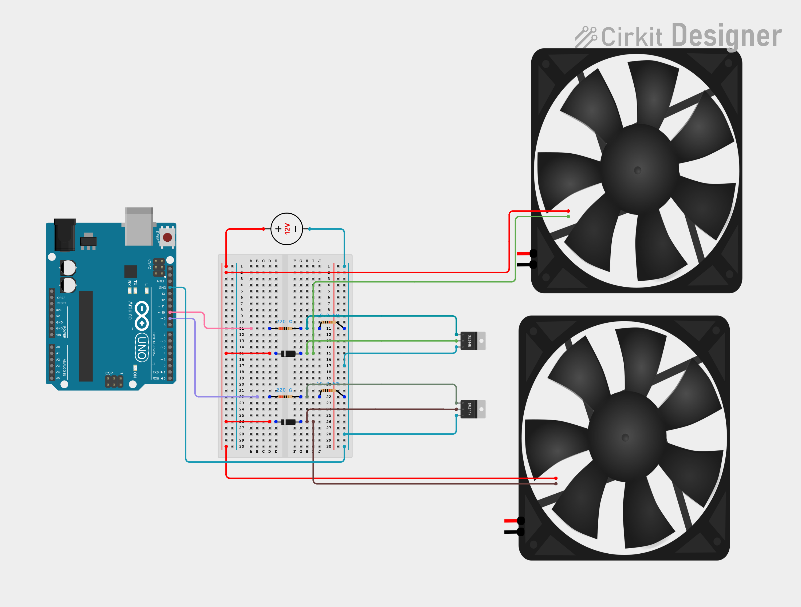

# Microcontroller — Hardware Guide

## Overview

The Airflow Simulation feature drives two 12V frontal fans whose speed follows the car's speed in-game, giving physical wind feedback while driving. The dashboard talks to a microcontroller (Arduino Uno/Nano-class board) over USB serial using a simple ASCII line protocol; the microcontroller drives the fans via PWM through a MOSFET switching stage (fans draw far more current than a microcontroller pin can supply).

Reference firmware: [`firmware/microcontroller/fan_airflow/fan_airflow.ino`](../../firmware/microcontroller/fan_airflow/fan_airflow.ino)

Manual bench-test firmware (no PC app required): [`firmware/microcontroller/fan_manual_test/fan_manual_test.ino`](../../firmware/microcontroller/fan_manual_test/fan_manual_test.ino) — see [Manual Bench Test](#manual-bench-test) below.

---

## Wire Protocol

| Parameter | Value |
|---|---|
| Transport | USB serial (CDC) |
| Baud rate | `9600` |
| Line format | ASCII, `\n`-terminated |

| Direction | Message | Meaning |
|---|---|---|
| App → device | `FAN:<0-255>\n` | Set PWM duty cycle for both frontal fans (same value) |
| App → device | `PING\n` | Connection test |
| Device → app | `PONG\n` | Reply to `PING` |

**Failsafe:** the firmware turns both fans off if no `FAN:` command is received within **5000 ms**. This timer is *not* reset by `PING`/`PONG` traffic — only a genuine `FAN:` command counts, so a connection-test loop can never keep the fans spinning without real speed data. The firmware also boots with duty `0` and stays off until the first valid `FAN:` command arrives. The app re-sends the current duty at least every 100ms (see `FanController.on_frame`), so this window has a comfortable ~50x margin during normal operation and only ever triggers on a genuine communication loss (app crash, USB unplugged, etc).

### Low-speed tuning (`FanController` constructor parameters)

A fan's starting and sustaining torque at low duty isn't perfectly predictable — it depends on the specific fan, voltage, and where the rotor happens to be resting. `FanController` (`src/simraceengineer/microcontroller/fan_controller.py`) has two constructor-only tuning knobs for this (not exposed in the Settings panel — they're hardware-calibration constants, not user preferences):

| Parameter | Default | Purpose |
|---|---|---|
| `kick_start_duty` / `kick_start_duration_s` | `255` / `0.2s` | Whenever the computed duty transitions from 0 to non-zero (fan starting from rest), briefly forces full duty for `kick_start_duration_s` before settling to the real target — guarantees the fan reliably overcomes static friction regardless of rotor rest position, instead of sometimes just buzzing without spinning at a low target duty. |
| `min_sustain_duty` | `0` (disabled) | Floors any non-zero computed duty up to this value, so cruising at a low in-game speed never asks the fan to sustain a duty too low to spin smoothly. Duty `0` (stopped/paused) is never floored. Disabled by default — find the right value for your specific fan by bench testing (start low, e.g. `1:20`, and raise until rotation stays smooth without stuttering), then set it when constructing `FanController`. |

---

## Wiring

Each fan channel is switched on the negative (low) side by an N-channel MOSFET, driven by a PWM-capable digital pin on the Arduino. Both fans are powered from a separate 12V supply that shares a common ground with the Arduino — the Arduino itself never carries fan current.

### Connection table (per fan channel)

| From | To |
|---|---|
| Arduino PWM pin (e.g. D9 for fan 1, D10 for fan 2) | MOSFET gate, through a 220Ω resistor |
| MOSFET gate | 10kΩ resistor to ground (pull-down, prevents floating gate at boot) |
| MOSFET source | Common ground (Arduino GND + 12V supply GND, tied together) |
| MOSFET drain | Fan's negative (–) wire |
| Fan's positive (+) wire | 12V supply positive rail |
| Flyback diode (1N4001) | Cathode to 12V positive rail, anode to MOSFET drain (i.e. in parallel with the fan, reverse-biased) — absorbs the inductive voltage spike when the fan switches off |

### Cirkit Designer diagram

Breadboard layout drawn in [Cirkit Designer](https://app.cirkitdesigner.com/):

> **Not yet fully verified.** Double-check before powering up: the MOSFET part label in this diagram (double-check it reads `IRLZ44N`, a logic-level MOSFET — not `IRFZ44N` or a similar-looking part number, which is **not** logic-level and won't switch fully from the Arduino's 5V gate signal), and that Arduino GND, the 12V supply's negative lead, and both MOSFETs' Source pins all land on the same ground net. Cross-check against the [Wiring](#wiring) table above before assembling on real hardware.

### Power-up / power-down order

Always power the Arduino **before** the 12V supply, and remove power in the opposite order:

1. **Powering up:** connect the Arduino via USB first, confirm it booted normally (onboard LED on, no reset loop, serial terminal responsive if open), *then* connect the 12V supply.
2. **Powering down:** send `0` over serial first (the bench-test firmwares have no failsafe timeout — a duty cycle you set stays applied until you change it), disconnect the 12V supply, *then* disconnect the Arduino/USB last.

Why this order matters: with the Arduino already running, its firmware actively drives the gate pin low (both bench-test firmwares and the reference firmware boot with duty `0`), reinforcing the 10kΩ pull-down resistor's job of keeping the MOSFET off *before* the load is energized. Powering the 12V rail first leaves that pull-down as the only thing holding the gate low during the Arduino's own boot/reset sequence — not dangerous by itself, but it opens a window where pin state can be less predictable, and makes it harder to isolate whether a problem is caused by the 12V stage or by a coincidental Arduino reset.

---

## Bill of Materials (BOM)

| Qty | Component | Approximate spec |
|---|---|---|
| 1 | Microcontroller board | Arduino Uno or Arduino Nano (5V logic, at least 2 PWM-capable digital pins) |
| 2 | DC fan | 12V DC fan, 120mm, 2- or 3-wire (see [Fan Recommendations](#fan-recommendations)) |
| 2 | N-channel MOSFET, logic-level | e.g. IRLZ44N (gate fully turns on from a 5V microcontroller pin) |
| 2 | Flyback diode | 1N4001 (or similar 1N400x rectifier diode), one per fan, to absorb inductive switch-off spikes |
| 2 | Gate resistor | 220Ω, one per MOSFET gate, current-limits the microcontroller pin driving the gate |
| 2 | Pull-down resistor | 10kΩ, one per MOSFET gate, holds the gate low (fan off) before the microcontroller finishes booting |
| 1 | 12V power supply / adapter | Sized for the combined current draw of both fans (check each fan's rated current and sum them, then add headroom) |
| 1 | Breadboard | Standard prototyping breadboard (no PCB needed for this build) |
| — | Jumper wires | Assorted male-to-male / male-to-female, for breadboard connections |
| 1 | USB cable | USB-A to USB-B (Uno) or USB-A to Mini/Micro-USB (Nano), for the Arduino-to-PC connection |

**Notes:**
- DC = Direct Current (as opposed to the AC/Alternating Current from a wall outlet) — the fans and the 12V supply both operate on DC.
- MOSFET = Metal-Oxide-Semiconductor Field-Effect Transistor, a solid-state switch used here to let the low-power microcontroller pin (5V, milliamps) switch the high-power fan circuit (12V, hundreds of milliamps to a few amps) on and off via PWM.
- PWM = Pulse-Width Modulation, the technique used to vary the fans' effective speed by rapidly switching the supply on and off at a varying duty cycle. All three firmwares (`fan_airflow.ino`, `fan_manual_test.ino`, `led_bench_test.ino`) reconfigure Timer1's prescaler in `setup()` to push the switching frequency on pins 9/10 from the Arduino default of ~490Hz (audible whine/buzz that changes pitch with duty cycle) up to ~31.4kHz (ultrasonic, inaudible) — this only changes the switching frequency, not `analogWrite()`'s 0–255 duty range or `millis()`/`micros()` (a separate timer).
- NPN = a bipolar transistor type (Negative-Positive-Negative doped layers). A simple NPN transistor (e.g. 2N2222) with the same flyback diode can substitute for the MOSFET on very small fans, but a logic-level MOSFET is recommended for reliable PWM switching of typical 120mm case fans.

---

## Fan Recommendations

This circuit controls speed by switching the fan's 12V power rail through the MOSFET (see [Wiring](#wiring)) — it does **not** send a PWM signal to a fan's dedicated speed-control wire. That means the fans must be **2- or 3-wire 12V DC fans** (power + ground, optionally a tachometer sense wire), **not 4-pin PWM fans**. A 4-pin fan's two power wires still work electrically, but you lose its native PWM input, and some 4-pin fans default to 100% speed if the control wire is left floating — so plain 2/3-wire fans avoid that pitfall entirely and are also cheaper.

| Criterion | Recommendation |
|---|---|
| Wire count | 2 or 3 wires (12V DC + GND, optional tachometer) — avoid 4-pin PWM fans |
| Size | 120mm is the sweet spot for airflow vs. cost vs. cockpit space. 140mm moves more air at a lower (quieter) RPM if space allows |
| Spec to prioritize | **Airflow (CFM / m³h)**, not static pressure — you're blowing into open air, not through a radiator or heatsink, so "airflow-optimized" fan blades outperform "static-pressure-optimized" ones here |
| Typical draw | ~0.15–0.3 A per fan at 12V for a generic 120mm unit around 1200–2000 RPM — check the chosen fan's datasheet and re-size the power supply from the BOM accordingly (sum both fans' current + headroom) |
| Model examples | Generic 120mm 12V 2/3-wire case fans (e.g. Arctic P12, Noctua NF-P12 redux 3-pin) work well — no need for a premium PWM-model fan, since speed control is handled entirely by the MOSFET, not the fan itself |
| Matching | Use two identical fans (same model/batch) so the airflow feels symmetric on both sides |

---

## Sourcing the Parts

None of the parts in the [BOM](#bill-of-materials-bom) are project-specific — they're common hobby-electronics components, available from general electronics distributors, hobbyist retailers, and online marketplaces.

| Component | Where to buy |
|---|---|
| Arduino Uno / Nano | Official Arduino store, Adafruit, SparkFun, Amazon, AliExpress (clones are significantly cheaper and work fine for this project) |
| MOSFET (e.g. IRLZ44N) | Digi-Key, Mouser, Amazon, AliExpress — search for the exact part number, since MOSFETs with similar names have different specs (see [Fan Recommendations](#fan-recommendations) for why the "L" in IRLZ44N matters) |
| Flyback diode (1N4001) | Digi-Key, Mouser, Amazon, AliExpress — usually sold in packs of 10–100, cheap enough to buy spares |
| Resistors (220Ω, 10kΩ) | Sold individually or, more commonly, as an assorted resistor kit — Amazon, AliExpress, Digi-Key, Mouser |
| 12V power supply | Any 12V DC wall adapter/power brick rated above your fans' combined current draw — electronics retailers, hardware stores, Amazon |
| Breadboard + jumper wires | Usually bundled in Arduino/electronics "starter kits" — Adafruit, SparkFun, Amazon, AliExpress |
| 120mm 12V fans | PC hardware retailers (for name-brand fans like Arctic or Noctua) or general electronics marketplaces for generic fans |
| USB cable | Any standard USB-A to USB-B (Uno) or USB-A to Mini/Micro-USB (Nano) cable — widely available anywhere |

**Regional note (Brazil):** local hobbyist electronics retailers such as RoboCore, FilipeFlop, Eletrogate, Curto Circuito, and BAÚ da Eletrônica carry the full kit (Arduino, MOSFETs, diodes, resistors, breadboards) with faster shipping than importing, and Mercado Livre is a common source for the 12V fans and power supply.

---

## Flashing the Firmware

1. Open `firmware/microcontroller/fan_airflow/fan_airflow.ino` in the Arduino IDE (or `arduino-cli`).
2. Select the correct board (Uno/Nano) and serial port.
3. Upload. The sketch has no external library dependencies.
4. In the Sim Race Engineer Settings panel, enable "Airflow Simulation", select the Arduino's serial port (auto-detected if it's the only one present), and use "Test Connection" to confirm the firmware replies `PONG` to `PING`.

---

## Manual Bench Test

Before wiring the board into the app, validate the wiring (MOSFETs, resistors, diodes, fans) by flashing [`firmware/microcontroller/fan_manual_test/fan_manual_test.ino`](../../firmware/microcontroller/fan_manual_test/fan_manual_test.ino) instead of the reference firmware and driving the fans by hand from any serial terminal — Arduino IDE's Serial Monitor, `screen /dev/tty.usbserial-XXXX 9600`, `minicom`, or `python -m serial.tools.miniterm <port> 9600`. Wiring is identical to the [Wiring](#wiring) section above; only the firmware differs.

1. Open `firmware/microcontroller/fan_manual_test/fan_manual_test.ino` in the Arduino IDE and upload it (same board/port steps as [Flashing the Firmware](#flashing-the-firmware)).
2. Open a serial terminal at `9600` baud, newline-terminated. The board prints a help banner on boot.
3. Type commands (press Enter after each):

   | Command | Effect |
   |---|---|
   | `<0-255>` | Set **both** fans to this PWM duty cycle (e.g. `128` ≈ 50%) |
   | `1:<0-255>` | Set fan 1 (D9) only — isolates that channel's wiring |
   | `2:<0-255>` | Set fan 2 (D10) only |
   | `0` | Stop both fans |
   | `?` | Reprint the help banner |

4. Start low (e.g. `1:60`) and increase gradually, confirming each fan spins smoothly and the MOSFET/diode don't overheat, before testing both channels together at higher duty cycles.

**Important:** this firmware has **no failsafe timeout** (unlike the reference firmware) — a duty cycle you set keeps running until you change it. Always send `0` before disconnecting or swapping back to the reference firmware.

Once both channels check out, re-flash [`fan_airflow.ino`](../../firmware/microcontroller/fan_airflow/fan_airflow.ino) and continue with step 4 above to connect it to the app.

---

## LED Bring-Up Test (fan-free)

Before wiring up the fans at all, you can validate the MOSFET switching stage (gate resistor, pull-down, MOSFET, flyback diode) with a cheap, instantly-visible LED instead — no moving parts, no fan noise, and a wiring mistake is obvious immediately instead of a fan quietly not spinning.

### Circuit change

Every component from the [Wiring](#wiring) table stays exactly as documented (gate resistor, pull-down resistor, MOSFET, flyback diode) — only the load changes:

| Original (fan) | LED test substitution |
|---|---|
| Fan's positive (+) wire → +12V rail | LED **anode** (long leg) → **new current-limiting resistor** → +12V rail |
| Fan's negative (−) wire → MOSFET drain | LED **cathode** (short leg / flat side) → MOSFET drain |
| Flyback diode (1N4001), parallel with the fan | Same — harmless to leave in place; it does no useful work with a resistive LED load (no inductive kickback to suppress), but doesn't hurt anything either |

**New part needed:** one current-limiting resistor per channel, in series between the +12V rail and the LED anode (a bare LED has no internal resistance like a fan's coil — connecting it straight to 12V destroys it almost instantly).

- **If you know the LED's color:** `R = (12V − Vf) / 0.02A`. Red/yellow (Vf ≈ 2V) → ~560Ω. Blue/white/green (Vf ≈ 3.2V) → ~470Ω.
- **If unsure of the color or Vf:** use **1kΩ** — safe for any common 5mm LED, just dimmer than the calculated value.

### Optional: power the rail from the Arduino's 5V pin instead of an external supply

For the LED test only, you can skip the external 12V supply entirely and power the LED rail from the Arduino's own **5V** pin — two LEDs draw only ~10–20mA total, well within what the USB-powered 5V pin can supply. This also removes the external-supply/common-ground wiring, since everything shares the Arduino's own GND automatically.

| Original (12V external) | 5V-from-Arduino variant |
|---|---|
| Fonte 12V (+) → +12V rail | Arduino **5V** pin → LED rail |
| Fonte 12V (−) → GND rail | *(not needed — already the Arduino's own GND)* |
| Current-limiting resistor: 560Ω / 470Ω / 1kΩ | **220Ω** (same value as the gate resistors R1/R3 — no new part needed) |

At 5V through 220Ω: ~13.6mA for a red/yellow LED (Vf≈2V), ~8mA for a blue/white/green LED (Vf≈3.2V) — safe for any common 5mm LED. The MOSFET's gate is already driven at 5V by D9/D10 regardless of rail voltage, so switching behavior is unaffected.

**⚠️ Do not use this shortcut for the real fans.** Two fans draw ~0.3–0.6A combined — far more than the Arduino's USB-powered 5V pin can safely supply (risking a brownout/reset), and 5V is the wrong voltage anyway: the app's speed-to-duty-cycle mapping is calibrated for 12V fans, so they'd spin far weaker and out of that calibration. Go back to the external 12V supply before wiring up the actual fans.

### Firmware

Flash [`firmware/microcontroller/led_bench_test/led_bench_test.ino`](../../firmware/microcontroller/led_bench_test/led_bench_test.ino) — identical command protocol to the fan bench-test firmware (same pins D9/D10, same `<0-255>`, `1:<0-255>`, `2:<0-255>`, `0`, `?` commands), just with output text worded for LEDs. PWM duty maps directly to perceived brightness, so `1:80` should visibly dim LED 1 compared to `1:255`.

Same caveat as the fan bench-test firmware: **no failsafe timeout** — send `0` before disconnecting.

Once both LED channels light up correctly (and dim smoothly as you sweep the duty cycle), swap the LED + resistor back out for the real fan + flyback diode wiring and move on to the [Manual Bench Test](#manual-bench-test) or straight to [Flashing the Firmware](#flashing-the-firmware).
